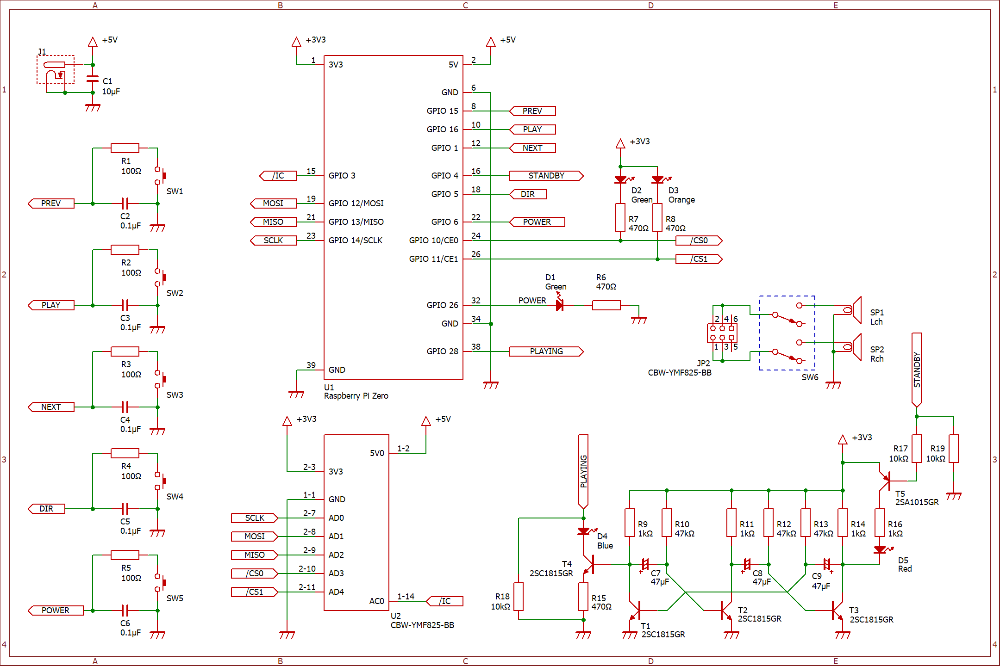

<p align="center">
  
</p>

<h1><span align="center">YMF825 Jukebox</span></h1>

YMF825 Jukebox は [YMF825Board](https://yamaha-webmusic.github.io/ymf825board/intro/) と Raspberry Pi Zero W を使った、FM音源ジュークボックスです。

## ymf825player

[YMF825 Dumper](https://github.com/nanase/ymf825dumper) で生成された YMF825 ダンプファイル (`*.825`) を展開、下記の ymf825reader を起動してダンプデータを標準入力に流します。また、Raspberry Pi の GPIO の管理も行っています。

使用言語は Python 3.5 以上、ライブラリとして [RPi.GPIO](https://sourceforge.net/p/raspberry-gpio-python/wiki/install/) を使用しています。

```sh
sudo apt-get install python3-pip python3-rpi.gpio
```

## ymf825reader

標準入力に渡されたデータをダンプデータとして解釈し、SPI を介して YMF825 と通信するためのプログラムです。

[bcm2835](http://www.airspayce.com/mikem/bcm2835/) を使っています。

```
wget http://www.airspayce.com/mikem/bcm2835/bcm2835-1.55.tar.gz
tar -zxvf bcm2835-1.55.tar.gz
cd bcm2835-1.55
./configure
make
sudo make install
```

## 想定回路図



### 入力ボタン

|ボタン名|説明|
|---|---|
|prev|前の曲を再生|
|play|再生または一時停止|
|next|次の曲を再生|
|dir|次のディレクトリの曲を再生|
|power|長押しで Raspberry Pi をシャットダウン|

### LED

|LED名|説明|
|---|---|
|power|ymf825player が起動中の時に点灯|
|standby|ymf825player が起動していない時に点灯または点滅|
|playing|演奏中に点灯または点滅|

## ライセンス

**MIT License**
